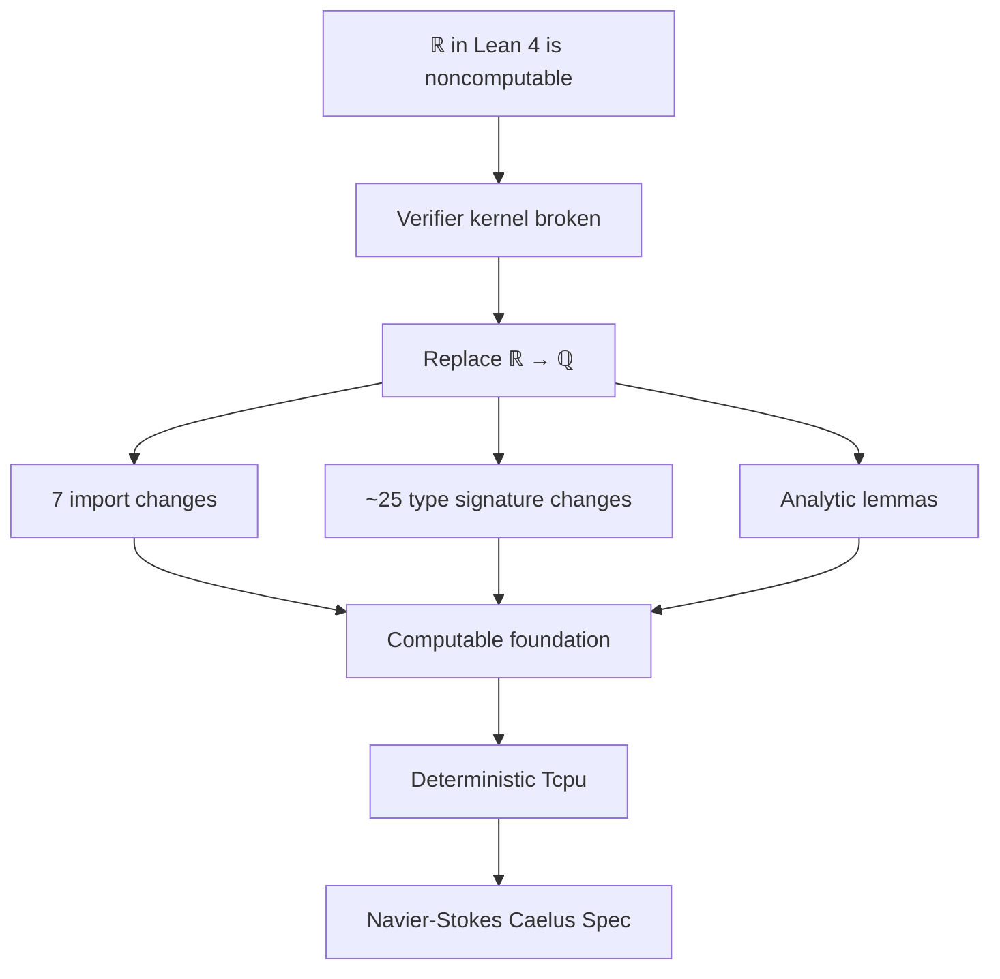

# Plan: Replace ℝ with ℚ in Coh V2 Foundation

## Executive Summary

This plan addresses the user's directive to replace ℝ (Real numbers) with ℚ (Rational numbers) throughout the Coh V2 discrete foundation to ensure computability and deterministic verification. The key issues identified are:

1. **Noncomputable ℝ**: Lean 4's `ℝ` is noncomputable, breaking the cryptographic verifier kernel
2. **Import changes**: 7 files import `Mathlib.Data.Real.Basic` 
3. **No sorry in Category.lean**: The semantic_initial proof is actually complete (uses `f.law`)

## Files Requiring Changes

### Import Changes (7 files)
Replace `import Mathlib.Data.Real.Basic` with `import Mathlib.Data.Rat.Order`:
- [ ] `Coh/Coh/V2/Primitive.lean`
- [ ] `Coh/Coh/V2/Definitions.lean`
- [ ] `Coh/Coh/V2/Certified.lean`
- [ ] `Coh/Coh/V2/Analytic.lean`
- [ ] `Coh/Coh/V2/VerifierPredicates.lean`
- [ ] `Coh/Coh/V2/BridgeLemmas.lean`
- [ ] `Coh/Coh/V2/CostBridge.lean`

### ℝ → ℚ Type Replacements

| File | Line(s) | Change |
|------|---------|--------|
| Primitive.lean | 21 | `cost : G → ℝ` → `cost : G → ℚ` |
| Category.lean | 22-24 | `V : X → ℝ`, `delta : ℝ` |
| Certified.lean | 22, 24-25 | `V : X → ℝ`, `spend : ℝ`, `defect : ℝ` |
| Definitions.lean | 24, 28, 36, 55 | `CostSet`, `delta`, `CompositeWitness.cost` |
| VerifierPredicates.lean | 23 | `CostBound` parameter `C : ℝ` |
| Example.lean | 19 | `V : State → ℝ` |
| FromV1.lean | 26, 56, 75, 109, 115 | Casts from ℕ/ℤ to ℝ |
| FiniteWord.lean | 28-29, 40-41 | `hiddenCost` returns ℝ |
| BridgeLemmas.lean | 26, 32 | Casts from ℕ/ℤ |
| CostBridge.lean | 20 | Return type |

### Real-Specific Lemmas Requiring Investigation

In `Analytic.lean`:
- Line 77: `Real.le_sSup_add_sSup` - Need ℚ equivalent
- `csSup` theorems - Verify ℚ has conditionally complete lattice instance

### The `sorry` Status

**No `sorry` in Category.lean's `semantic_initial`** - The proof is complete:
```lean
law := f.law,  -- Uses f's law, no sorry
```

However, there IS a `sorry` in:
- `FiniteWord.lean` line 143: Structural independence axiom placeholder

## Implementation Steps

### Step 1: Update Imports
Perform global find-replace on import statements in all 7 files.

### Step 2: Update Type Signatures
Replace all `: ℝ` and `→ ℝ` with `: ℚ` and `→ ℚ` in type signatures.

### Step 3: Fix Casts
- Change `(x : ℕ)` casts from `: ℝ` to `: ℚ`
- Change `(x : NNReal)` casts from `: ℝ` to `: ℚ`

### Step 4: Update Analytic.lean
- Replace `Real.le_sSup_add_sSup` with ℚ equivalent
- Verify conditionally complete lattice lemmas work for ℚ

### Step 5: Compile and Fix
Run `lean --make` and address any remaining type errors or API mismatches.

## Mermaid Diagram: Change Impact



## Questions for User

1. Should `NNReal` (non-negative reals) also be replaced with `ℚ≥0` (non-negative rationals)?

2. The `sorry` in FiniteWord.lean (structural independence axiom) - should this also be addressed in this pass?

3. Do you want me to proceed to Code mode to implement these changes?