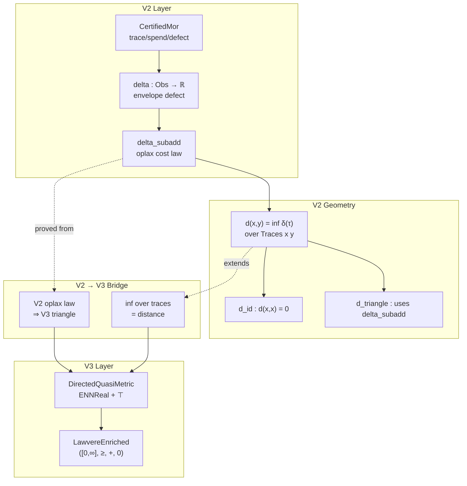

# V2 → V3 Bridge Plan

## Executive Summary

The V2 → V3 bridge shows that V2's projection-certified oplax defect structure induces directed Lawvere quasi-metric geometry. **Key finding**: V2 `Geometry.lean` already implements the core V3 distance concept. The task is to formalize V3 as a standalone abstraction with ENNReal and create the clean bridge layer.

## Current State Analysis

### What Already Exists in V2

| Module | Contents | Relevance |
|--------|----------|-----------|
| `V2/Geometry.lean` | `d A T x y`, `d_id`, `d_nonneg`, `d_triangle` | **Core V3 distance already implemented** |
| `V2/Analytic.lean` | `delta_id`, `delta_nonneg`, `delta_subadd` | **Oplax defect law** |
| `V2/Certified.lean` | `CertifiedMor`, `idMor`, `compose` | Certified trace structure |

### What V3 Adds (beyond V2 Geometry)

1. **ENNReal** for extended metrics (`+∞` handling)
2. **Lawvere enrichment structure** explicit formulation
3. **Clean abstraction** separating V3 from V2 implementation details
4. **Formal bridge theorems** connecting the two layers

## Lean Module Architecture

```
Coh/
├── Coh/
│   └── V3/
│       ├── Distance.lean      -- Directed quasi-metric distance
│       ├── Lawvere.lean        -- Lawvere enrichment structure
│       └── FromV2.lean         -- Bridge theorems
```

## Detailed Design

### 1. V3/Distance.lean

```lean
/--
  Directed extended quasi-metric on a state space.
  
  Extends V2's distance to use ENNReal for proper handling of
  unreachable states (distance = ⊤).
-/
class DirectedQuasiMetric (State : Type) where
  d : State → State → ENNReal
  
  -- Nonnegativity
  d_nonneg : ∀ x y, 0 ≤ d x y
  
  -- Identity zero
  d_self : ∀ x, d x x = 0
  
  -- Directed triangle inequality
  d_triangle : ∀ x y z, d x z ≤ d x y + d y z
```

### 2. V3/Lawvere.lean

```lean
/--
  Lawvere enrichment over ([0,∞], ≥, +, 0).
  
  A category is Lawvere-enriched when hom-sets carry
  directed quasi-metric structure satisfying:
  - Composition is nonexpansive
  - Identities have distance 0
-/
class LawvereEnriched (C : Type) [Category C] where
  dist {X Y : C} : X ⟶ Y → Y ⟶ X → ENNReal
  
  -- Enrichment condition
  dist_comp : ∀ {X Y Z} (f : X⟶Y) (g : Y⟶Z),
    dist (g ≫ f) f ≤ dist g f + dist f f
```

### 3. V3/FromV2.lean (The Bridge)

```lean
/--
  Bridge Theorem: V2 oplax defect law ⇒ V3 directed triangle inequality.
  
  Given:
  - V2 system with Assumptions + SegmentableAssumptions
  - V2 TransitionSystem T
  - V2 distance d(x,y) = inf δ(τ) over admissible traces
  
  Then:
  - d forms a DirectedQuasiMetric
  - Coh categories are Lawvere-enriched over ([0,∞], ≥, +, 0)
-/
theorem v2_to_v3_bridge {S : System} (A : SegmentableAssumptions S)
    {X : Type} (T : TransitionSystem S X) :
    @DirectedQuasiMetric X where
  d := fun x y => if h : (Traces S T x y).Nonempty
                  then sInf (delta S '' Traces S T x y)
                  else ⊤
  d_nonneg := ...
  d_self := ...
  d_triangle := ...
```

## Proof Strategy

### Lemma Stack (already proven in V2 Geometry)

| Lemma | V2 Source | V3 Use |
|-------|-----------|--------|
| `d_nonneg` | `Geometry.lean:d_nonneg` | Nonnegativity axiom |
| `d_self` | `Geometry.lean:d_id` | Identity zero |
| `d_triangle` | `Geometry.lean:d_triangle` (uses `delta_subadd`) | Triangle inequality |

### Bridge Theorems to Prove

1. **Core bridge** (`FromV2.lean`):
   ```lean
   theorem oplax_defect_law_implies_triangle :
     δ(τ₂ ⊙ τ₁) ≤ δ(τ₁) + δ(τ₂) → d(x,z) ≤ d(x,y) + d(y,z)
   ```

2. **Lawvere enrichment** (`FromV2.lean`):
   ```lean
   theorem certified_morphisms_enrich_over_lawvere :
     ∀ {X Y Z} (f : CertifiedMor ... X Y) (g : CertifiedMor ... Y Z),
       d_Coh(g ≫ f) f ≤ d_Coh g f + d_Coh f f
   ```

## ENNReal Migration

The current V2 `d` returns `ℝ`. V3 should use `ENNReal`:

```lean
-- Current (V2)
def d {S : System} ... (x y : X) : ℝ := sInf ...

-- V3 target
def d_ext {S : System} ... (x y : X) : ENNReal := 
  if h : (Traces S T x y).Nonempty then
    ENNReal.ofReal (sInf (delta S '' Traces S T x y))
  else ⊤
```

Migration theorems:
```lean
theorem d_ext_eq_d_for_reachable {h : (Traces ...).Nonempty} :
    d_ext x y = ENNReal.ofReal (d A T x y)

theorem d_ext_top_for_unreachable {h : ¬(Traces ...).Nonempty} :
    d_ext x y = ⊤
```

## Failure Analysis Integration

The plan addresses all four failure modes:

| Failure | Mitigation |
|---------|------------|
| Trace closure fails | Explicitly require `TransitionSystem` with `comp_defined` |
| Identity tightness fails | Require `delta_id` from Assumptions |
| Oplax law fails | Require `SegmentableAssumptions` for `delta_subadd` |
| Empty domains mishandled | Use ENNReal with `⊤` for unreachable states |

## Implementation Order

1. **V3/Distance.lean** - Define `DirectedQuasiMetric` class and basic properties
2. **V3/Lawvere.lean** - Define `LawvereEnriched` class
3. **V3/FromV2.lean** - Bridge theorems importing V2 and exporting V3
4. **Update Geometry.lean** - Add V3 compatibility layer

## Mermaid: Bridge Architecture



## Verification Checklist

- [ ] V3/Distance.lean compiles
- [ ] V3/Lawvere.lean compiles
- [ ] V3/FromV2.lean compiles
- [ ] Bridge theorem proves triangle from oplax law
- [ ] ENNReal migration complete
- [ ] Existing V2 tests still pass
- [ ] Manuscript section added

## Estimated Scope

The core implementation is ~150-200 lines of Lean:
- Distance.lean: ~60 lines
- Lawvere.lean: ~50 lines
- FromV2.lean: ~80 lines

The V2 Geometry already provides all the key lemmas.